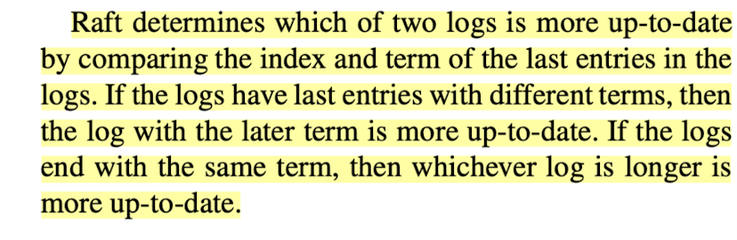
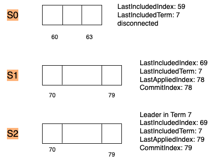

串行发送heartbeats, 或者串行等待结果，导致如下问题

1. s0 s1, s2, 选举s0作为leader
2. Disconnect s0
3. s1, s2选举s2作为leader
4. S2向s0发送heartbeats, 迟迟没有向s1发送heartbeats, s1开始发起选举 

 为每个rpc请求创建一个go routine, 在go routine 发送请求，并且处理reply

 	1. 加锁， rf.mu.Lock()
 	2. 检查 rf.role 不变，为 Candidate 或者Leader
 	3. 处理reply，转换状态
 	 	1. 如果reply.Term> rf.currentTerm, rf.role <- follower
 	 	2. 对于requestVote reply，查看vote数量，rf.role <- Leader

## bug：apply error, servers commit different log at same index

五个节点, s1为Leader，并且收到client cmd(1:7525), 将log 发送给followers, s0 和s3接收到log， 返回True。Leader s1随即commit 此log。s1节点断开，s2节点 增加term为2，并且发起投票，debug log 显示s0 向s2投票。这显然不对。RAFT 通过选举限制 保证每个term中的新leader 一定包含之前的term中 committed log。

<div align = center>

<div>

我在发送requestVote请求时，先将lastLogTerm 设为节点currentTerm(在这个context下 为2)，再检查是否有lastLogIndex >= 1;

这种情况下，s0会向s2投票。

当节点的log为空时，lastLogTerm 应为以一个值表示 least up-to-date。在群友的提示下，我这里设为-1，解决问题。

对commitIndex 和lastApplied 理解。

commitIndex 从下标1开始，指向应该被commit的最新log

lastApplied 从下标0开始，指向本次commit的第一个log。两者相等表示commit完成


## bug: index out of range -2 

``` bash
panic: runtime error: index out of range [-2]

goroutine 15789 [running]:
6.824/raft.(*Raft).applier.func1(0x4)
	/Users/leslie/Documents/courses/6.824/src/raft/raft.go:650 +0x1167
created by 6.824/raft.(*Raft).applier
	/Users/leslie/Documents/courses/6.824/src/raft/raft.go:638 +0x5c5
exit status 2
FAIL	6.824/raft	21.733s
```

具体的代码为

```c++
args.PrevLogIndex = nextIndex[server] - 1
args.PrevLogTerm = 0
if args.PrevLogIndex != 0 {
  args.PrevLogTerm = logs[args.PrevLogIndex-1].Term // line 650
}
```

此时 `args.PrevLogIndex-1`为-2说明 nextIndex[server]为0， nextIndex[]是在处理append entry reply时维护的。看具体的代码

```c++
// applier
if reply.Accept {  // accept 
  rf.nextIndex[server] = len(logs) + 1
  rf.matchIndex[server] = len(logs)
  rf.apply()
} else if reply.Term > rf.currentTerm {  // outdate leader 
  rf.currentTerm = reply.Term
  rf.votedFor = -1
  rf.persist()
  rf.role = Follower
} else { // reply.accept == false && reply.Term <= rf.current
  if reply.Xterm == -1 {
    rf.nextIndex[server] = reply.Xlen + 1
	} else {
    xTerm := reply.Xterm
    index := reply.Xindex
    for i := args.PrevLogIndex - 1; i >= 0; i-- {
      if rf.logs[i].Term < xTerm {
        break
      }
      if rf.logs[i].Term == xTerm {
        index = i + 1
        break
      }
    }
    rf.nextIndex[server] = index
  } // else  
}// else 
```

如果nextIndex[server] 为0,那么只有repley.Xindex为0，并且 leader logs中没有xTerm。接下来看 reply.Xindex维护的相关代码

```c++
// AppendEntry handler
if  args.PrevLogIndex > len(rf.logs) {
		reply.Term = rf.currentTerm
		reply.Accept = false
		Debug(dInfo, "S%d args.PrevLogIndex is %d, len(rf.logs) is %d", rf.me, args.PrevLogIndex, len(rf.logs))
		reply.Xterm = -1;
		reply.Xlen = len(rf.logs)
		Debug(dInfo, "S%d append reply is %v", rf.me, *reply)
		return
}
if (args.PrevLogIndex != 0 && rf.logs[args.PrevLogIndex - 1].Term != args.PrevLogTerm) {
		Debug(dInfo, "S%d last entry not equal", rf.me)
		reply.Term = rf.currentTerm
		reply.Accept = false
		reply.Xterm = rf.logs[args.PrevLogIndex - 1].Term  // conflicting term
		for i := args.PrevLogIndex - 1; i >= 0; i -- {
			if rf.logs[i].Term != reply.Xterm {  //
				break
			}
			reply.Xindex = i + 1
		}
		return
}
```

两个`if`逻辑都不会将`reply.xIndex`设为 0 ;

具体的`Log`

```bash
215399 INFO S2 [Leader: 16] receive append reply {false 15 0 0 0} from S4 
215399 INFO S4 not accept, xterm: 0 xindex: 0 xlen: 0
215400 INFO S4 not accept, rf.nextIndex[4]-->0
215431 LOG1 S2 [Leader] length of log is 469
215473 LOG1 S2 [Leader] length of log is 470
panic: runtime error: index out of range [-2]
```

`S2`收到 `S4`的 reply, `reply.Term = 15, reply.Accept = false, reply.Xterm = 0, reply.xIndex = 0, reply.xlen = 0` 这样的回复 会让 nextIndex[server] = 0 

为什么收到这样的回复？之前的log显示, 

```bash
195590 LOG1 S4 term 15 recevie append entry from S2, term 9
195590 INFO S4 append reply is {false 15 0 0 0}
195711 LOG1 S1 term 15 recevie append entry from S2, term 9
195711 INFO S1 append reply is {false 15 0 0 0}
196733 LOG1 S4 term 15 recevie append entry from S2, term 9
196734 INFO S4 append reply is {false 15 0 0 0}
196803 LOG1 S1 term 15 recevie append entry from S2, term 9
196803 INFO S1 append reply is {false 15 0 0 0}
197599 LOG1 S4 term 15 recevie append entry from S2, term 9
197599 INFO S4 append reply is {false 15 0 0 0}
```

`S2`在`Term = 9`时为leader, 此时`S1`和`S4 Term 为15`，这样回复`{false 15 0 0 0}`

`s2`收到 `s1`的回复，`term`变为15, 并且成为`term = 16`的leader。之后收到 `s4`的回复`{false 15 0 0 0}`

将 `nextIndex[4]-->0`。那么原因就是收到过期的回复。

看看`RequestVote, AppendEntry`对 `term`的处理，可以知道一个合理的`reply`有这样的条件，`reply.Term >= rf.currentTerm`

所以有这样的处理逻辑

```c++
// ticker
rf.mu.Lock()
defer rf.mu.Unlock()
if rf.role != Candidate || rf.currentTerm != args.Term{
  return 
}
if reply.Term < rf.currentTerm {
  return
}

// applier
rf.mu.Lock()
defer rf.mu.Unlock()
if rf.role != Leader || rf.currentTerm != args.Term{
  return 
}
if reply.Term < rf.currentTerm {
  return
}
```

## bug:  apply error: server 4 apply out of order 92

```bash
196890 LOG1 S0 length of log is 93
196890 CMIT S4 apply command 9074 at index 70 end is 91
196890 CMIT S4 apply command 543 at index 71 end is 91
196890 CMIT S4 apply command 3256 at index 72 end is 91
196891 CMIT S4 apply command 8368 at index 73 end is 91
196891 CMIT S4 apply command 3772 at index 74 end is 91
196891 CMIT S4 apply command 7342 at index 75 end is 91
196891 CMIT S4 apply command 3915 at index 76 end is 91
196892 CMIT S4 apply command 9935 at index 77 end is 91
196892 CMIT S4 apply command 8453 at index 78 end is 91
196892 CMIT S4 apply command 5248 at index 79 end is 91
196892 CMIT S4 apply command 1643 at index 80 end is 91
196892 CMIT S4 apply command 7208 at index 81 end is 91
196893 CMIT S4 apply command 7147 at index 82 end is 91
196893 CMIT S4 apply command 818 at index 83 end is 91
196893 INFO S4 [Leader: 20] receive append reply {true 20 0 0 0} from S0 
196893 CMIT S4 apply command 2816 at index 84 end is 91
196894 LEAD S4 [Leader] nextindex[0]: 94, matchIndex[0]: 93
196894 CMIT S4 apply command 831 at index 85 end is 91
196894 CMIT S4 apply command 7384 at index 86 end is 91
196894 CMIT S4 apply command 1885 at index 92 end is 93
196895 CMIT S4 apply command 4580 at index 87 end is 91
196895 CMIT S4 apply command 3598 at index 93 end is 93
apply error: server 4 apply out of order 92
```

意思是某个index没有按顺序commit。log显示 `S4`先`apply [70, 91]`之前的`log`， 然后`[92, 93]`之前的`log`也在commit，导致顺序错乱。看具体的代码

```go
// rf.apply
logs := []entry{}
logs = append(logs, rf.logs...)
go func(beg, end int) {
	for beg < end { // apply
		msg := ApplyMsg{
			CommandValid: true,
			Command: logs[beg].Command,
			CommandIndex: beg + 1, // 偏移 1 位
		}
		Debug(dCommit, "S%d apply command %v at index %d", rf.me, msg.Command, msg.CommandIndex);
		rf.applyCh <- msg
		beg ++
	}
}(rf.lastApplied, rf.commitIndex)
rf.lastApplied = rf.commitIndex
```

`Leader`或者`Follower`发现 `lastApplied`和`commitIndex`有可能不相等时，调用`rf.apply()`, `rf.apply()`开启独立的线程去`apply [beg, end]`之间的`log`, 这样就可能造成顺序混乱。改成顺序就可以了

```c++
// rf.apply()
for rf.lastApplied < rf.commitIndex { // apply
	msg := ApplyMsg{
		CommandValid: true,
		Command: logs[rf.lastApplied].Command,
		CommandIndex: rf.lastApplied + 1, // 偏移 1 位
	}
	Debug(dCommit, "S%d apply command %v at index %d end is %d", rf.me, msg.Command, msg.CommandIndex, rf.commitIndex);
	rf.applyCh <- msg
	rf.lastApplied ++
}
```


## bug: servers commit different command at same index 

```bash
051131 LOG1 S1 [Leader: 5] length of log is 2  # new leader 
051136 LOG1 S3 [Leader: 3] length of log is 35

051194 LOG1 S2 term 5 recevie append entry from S1, term 5
051194 ROLE S2 ---> follower after recevie from valid Leader
051194 LOG1 S4 term 5 recevie append entry from S1, term 5
051195 TIMR S2 reset time: 554
051195 ROLE S4 ---> follower after recevie from valid Leader
051195 TIMR S4 reset time: 747	# follower receive append entries from Leader S1

051196 LOG1 S2 length of log is 2
051196 LOG1 S4 length of log is 2 # follower's logs have caught up with Leader's logs

051197 INFO S1 [Leader: 5] receive append reply {true 5 0 0 0} from S2 
051198 LEAD S1 [Leader] nextindex[2]: 3, matchIndex[2]: 2
051199 INFO S1 [Leader: 5] receive append reply {true 5 0 0 0} from S4 
051199 LEAD S1 [Leader] nextindex[4]: 3, matchIndex[4]: 2 # Leader S1 receive append entry reply from followers and set nextindex[]

051199 CMIT S1 apply command 6951 at index 1 end is 2
051199 CMIT S1 apply command 6746 at index 2 end is 2 # quorum existes Leader apply these commands 

051247 LOG1 S1 [Leader: 5] length of log is 3

051248 LOG1 S4 term 5 recevie append entry from S1, term 5
051249 ROLE S4 ---> follower after recevie from valid Leader
051249 TIMR S4 reset time: 556
051249 LOG1 S3 [Leader: 3] length of log is 36
051250 LOG1 S4 length of log is 1 # after receiving append entry from valid, follower discards the log that should be preserved;

051272 VOTE S4 reject votes for S1 votedFor != -1 term is 5

051389 LOG1 S2 term 5 recevie append entry from S1, term 5
051389 ROLE S2 ---> follower after recevie from valid Leader
051390 TIMR S2 reset time: 752
051391 LOG1 S2 length of log is 1 # after receiving append entry from valid, follower discards the log that should be preserved;

052155 LOG1 S4 term 5 recevie append entry from S0, term 1
052155 INFO S4 append reply is {false 5 0 0 0}
052244 LOG1 S2 term 5 recevie append entry from S0, term 1
052245 INFO S2 append reply is {false 5 0 0 0}
052249 INFO S0 [Leader: 1] receive append reply {false 5 0 0 0} from S2 
052266 ROLE S0 [Leader] -> Follower, append entry reply from S2, term becomes 5

// len of log S1 [leader: 5] grows to 44 
// len of log S3 [Leader: 3] grows to 77 

061257 TIMR S4 reset time: 598
061258 VOTE S4 request votes at term 6
061397 ROLE S0 --> Follower at Term 6
061397 VOTE S0 reject votes for S4 lastTerm is 1, lastLogIndex is 116, args.LastLogIndex is 1 
061459 ROLE S2 --> Follower at Term 6
```

Rpc request may arrive at the target endpoint in disorder. The old request should be checked and possibly ignored; Here is the context that may cause above bug;

>Leader send appendEntry 1 with preLogIndex being 80 and len of entries being 5, then appendEntry2 with same preLogIndex but legth of entry being 10. If follower recevies appendEntry2 then receives appendEntry1, follower's log will be trimmed to 85. if the command at index 86 has been applied, servers may apply different commands at same index

Solution: 

​	if follower's post appended log is shorter than orginal log and is sub set of original log, then this append entry is invalid and should be ignored

small optimization:

​		if args.Term equals to rf.currentTerm and args.CandidateId == rf.votedFor, return true, this avoid leader's unecessary wait.

## bug:  servers failed to reach agreement after 10 seconds 

>--- FAIL: TestFigure8Unreliable2C (65.53s)
>    config.go:609: one(3657) failed to reach agreement after 10 seconds

Error Log says that even in steady state (no crash, no disconnection), servers fail to reach agreement within 10s; This is pretty weird. By analysising the logs, I notice that all servers, except for the lagging peer, success in applying the command. And one error log show that the lagging peer has caught up with the leader and is applying commands when the test fails due to time out. So I think something proceeds abnomaly slowly. 

```bash
655249 CMIT S2 apply command 9717 at index 20 end is 595
# lagging peer is applying 
655256 CMIT S2 apply command 791 at index 365 end is 595
655256 CMIT S2 apply command 7360 at index 366 end is 595
655256 CMIT S2 apply command 7573 at index 367 end is 595
--- FAIL: TestFigure8Unreliable2C (65.53s)
    config.go:609: one(3657) failed to reach agreement after 10 seconds
```

```bash
565774 INFO S3 not accept, rf.nextIndex[3]-->465
566173 INFO S3 not accept, rf.nextIndex[3]-->493
566629 INFO S3 not accept, rf.nextIndex[3]-->465
574686 INFO S3 not accept, rf.nextIndex[3]-->438
575421 INFO S3 not accept, rf.nextIndex[3]-->323
576535 INFO S3 not accept, rf.nextIndex[3]-->251
577649 INFO S3 not accept, rf.nextIndex[3]-->237
578559 INFO S3 not accept, rf.nextIndex[3]-->438
578905 INFO S3 not accept, rf.nextIndex[3]-->323
580300 INFO S3 not accept, rf.nextIndex[3]-->438
582033 INFO S3 not accept, rf.nextIndex[3]-->323
586837 INFO S3 not accept, rf.nextIndex[3]-->251
590684 INFO S3 not accept, rf.nextIndex[3]-->237
593126 INFO S3 not accept, rf.nextIndex[3]-->212
593883 INFO S3 not accept, rf.nextIndex[3]-->190
594624 INFO S3 not accept, rf.nextIndex[3]-->237
598638 INFO S3 not accept, rf.nextIndex[3]-->212
598907 INFO S3 not accept, rf.nextIndex[3]-->251
601711 INFO S3 not accept, rf.nextIndex[3]-->212
602903 INFO S3 not accept, rf.nextIndex[3]-->170
603337 INFO S3 not accept, rf.nextIndex[3]-->190
603375 INFO S3 not accept, rf.nextIndex[3]-->212
603852 INFO S3 not accept, rf.nextIndex[3]-->237
605624 INFO S3 not accept, rf.nextIndex[3]-->237
607821 INFO S3 not accept, rf.nextIndex[3]-->190
609630 INFO S3 not accept, rf.nextIndex[3]-->212
611854 INFO S3 not accept, rf.nextIndex[3]-->170
612739 INFO S3 not accept, rf.nextIndex[3]-->212
614761 INFO S3 not accept, rf.nextIndex[3]-->130
616131 INFO S3 not accept, rf.nextIndex[3]-->68
616526 INFO S3 not accept, rf.nextIndex[3]-->190
617427 INFO S3 not accept, rf.nextIndex[3]-->170
617895 INFO S3 not accept, rf.nextIndex[3]-->190
```

>The nextIndex change for a lagging peer end up in a dead loop. This causes servers fail to reach agreemnt in 10s;  if follower's log and leader's log diverge across multiple terms, then follower will return multiple appendentry with false, leader's nextindex shouldn't become larger or previously recorded value, which could lead to a dead loop. 

## bug: index out of range I

a weird index error.

> 333326 CMIT S0 updateCommitIndex rf.commitIndex is 0
> 
> 333326 ERRO S0 updatecommmitIndex rf.commitIndx is 0, lastIncludedIndex: 179
> 
> 333327 CMIT S0 updatecommitIndex i: 0, lastIncludedIndex: 179
panic: runtime error: index out of range [-179]
 
Log says that S0's commitIndex is 0 and lastIncludedIndex is 179, which doesn't make sense.

Procedures that cause this bug
> 608623 TIMR S0 reset time: 506
> 
> 608623 VOTE S0 request votes at term 23
>
> 608627 TIMR S1 time reduced to 14
> 
> 608675 TIMR S2 time reduced to 214
> 
> 608678 ROLE S2 --> Follower at Term 23
> 
> 608679 VOTE S2 votes for S0, reset time: 680
> 
> 608681 ROLE S0 becomes Leader, gets 2 votes, at term 23
> 
> 608752 VOTE S0 reject votes for S1 args.Term: 22 rf.currentTerm 23
> 
> 608755 ROLE S1 becomes Follower, term: 22 --> 23
> 
> 608791 VOTE S2 reject votes for S1 args.Term: 22 rf.currentTerm 23
> 
> 608810 TIMR S1 time reduced to -4
> 
> 608812 TIMR S1 reset time: 762
> 
> 608812 VOTE S1 request votes at term 24
> 
> 608846 LOG1 S2 term 23 receive append entry from S0, term 23
> 
> 608846 ROLE S2 ---> follower after receive append entry from valid Leader
> 
> 608846 VOTE S1 reject votes for S0 args.Term: 23 rf.currentTerm 24
> 
> 608846 TIMR S2 reset time: 519
> 
> 608847 LOG1 S2 length of log is 323
> 
> 608848 INFO S2 commitIndex: 0
> 
> ....
> 
> 614141 TIMR S2 reset time: 734
> 
> 614141 VOTE S2 request votes at term 25
> 
> 614166 TIMR S1 time reduced to 242
> 
> 614167 TIMR S0 time reduced to -1
> 
> 614168 TIMR S0 reset time: 598
> 
> 614169 VOTE S0 request votes at term 25
> 
> 614195 ROLE S1 --> Follower at Term 25
> 
> 614196 VOTE S1 votes for S2, reset time: 705
> 
> 614198 ROLE S2 becomes Leader, gets 2 votes, at term 25
> 

`S0` attempts to become a leader at term 23, `S2` votes for `S0`, `S0` is elected as leader at term 23 and send heartbeats to followers. In this heartbeat args, the code doesn't set the `CommitIndex`, which is 0 by default. This explains why `S2` commitIndex become 0.  `S1` receives vote request from `S0` and increments its term to 23. Then immediately, `ticker` goroutine gets scheduled and `S0` initiates a leader election at term 24, causing `S0` and `S1` to be follower at term 24. Then `S2` elected as leader at term 25.

## bug: index out of range II
Cross into another index error with similar error log as above
> 176165 CMIT S2 updateCommitIndex rf.commitIndex is 78
> 
> 176166 CMIT S2 updatecommitIndex i: 78, lastIncludedIndex: 79
> 
> panic: runtime error: index out of range [-1]

Case:

<div align = center> 
 
</div>

> `S2` is a leader at term 7, last log index 79, last applied index and last commit index 79.
>
> Before `S2` sends an appendentry rpc to tell `S1` to apply command at index 79, `S0` is reconnected and intiates a leader election at term 8. 
>
> `S2` and `S1` receives voteRequest rpc and turns into a Follower at term 8. 
>
> For its shorter log, `S0` won't be elected as leader at term 8. 
>
> Then `S1` attempts to be the leader at term 9 for the vote from `S2`. `S1` sends heartbeats to `S2` with LeaderCommitIndex being 78. 
>
> At the same time, `S0` receives voterequest from `S1` and turns into a Follower at term 9. 
>
> Before `S0` votes for `S1` and reset its timer, `ticker` waken up and `S0`
>
> `S0` requests to be a leader at term 10 and turns `S1` and `S2` into follower at term 10. Again `S0` won't success
```bash
168419 TIMR S1 time reduced to -1
168422 TIMR S1 reset time: 730
168422 VOTE S1 request votes at term 9
168430 ROLE S0 becomes Follower, term: 8 --> 9 # get request vote 
168493 TIMR S2 time reduced to 19
168559 ROLE S2 --> Follower at Term 9
168560 VOTE S2 votes for S1, reset time: 794
168562 ROLE S1 becomes Leader, gets 2 votes, at term 9
168607 TIMR S0 time reduced to -6
168609 TIMR S0 reset time: 749
168609 VOTE S0 request votes at term 10
168727 ROLE S1 --> Follower at Term 10
168790 LOG1 S2 term 9 receive append entry from S1, term 9
168791 ROLE S2 ---> follower after receive append entry from valid Leader
168791 TIMR S2 reset time: 650
168793 LOG1 S2 length of log is 79
168793 INFO S2 AppendEntry commitIndex: 78
```
8. Later, `S2` attempts to be a leader at term 11 with **incorrect commitIndex 78**.

These two index errors make me wander there may be logic errors when dealing Follower's commitIndex. I turn to paper's Figure2, which says that `If leaderCommit > commitIndex, set commitIndex = min(leaderCommit, index of last new entry)`. Well, this explains everything. My orginal imp just sets `commitIndex = min(leaderCommit, index of last new entry)`. 

```go
rf.commitIndex = len(rf.logs) + rf.lastIncludedIndex
if args.LeaderCommitIndex < rf.commitIndex {
	rf.commitIndex = args.LeaderCommitIndex
}
```

So correct handle should be
```go
lastIndex := len(rf.logs) + rf.lastIncludedIndex
if args.LeaderCommitIndex > rf.commitIndex {
	rf.commitIndex = min(lastIndex, args.LeaderCommitIndex)	
}
```
This case denotes that it's possible for leader's commitIndex smaller than follower's

## four way deadlock 
Doc at the bottom of [student-guide](https://thesquareplanet.com/blog/students-guide-to-raft/)
